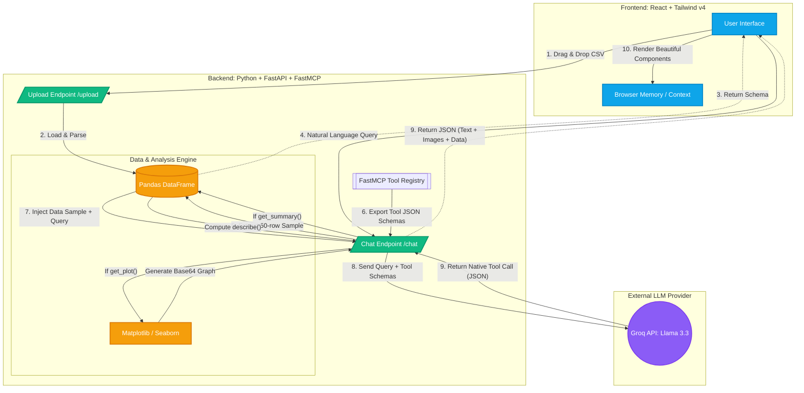

# DataPilot AI: System Architecture & Workflow

This document outlines the architecture and step-by-step workflow of the DataPilot AI application. The system operates on a modern **LLM Orchestration** pattern, where the LLM acts as an intelligent router rather than just a text generator.

## High-Level Architecture Diagram

---

## Detailed Step-by-Step Workflow

### Phase 1: Data Ingestion
1. **User Action**: The user drops a CSV file into the React frontend.
2. **Transmission**: The file is sent via `multipart/form-data` to the FastAPI `/upload` endpoint.
3. **Memory Storage**: Pandas reads the file bytes directly into a global backend memory object (`state.df`).
4. **Schema Extraction**: The backend extracts the column names and total row count, returning them to the React app to populate the sidebar.

### Phase 2: LLM Orchestration & FastMCP
1. **User Query**: The user asks a question (e.g., *"Plot category vs quantity"* or *"What is the top product?"*).
2. **Context Injection**: The FastAPI backend captures the query. It slices the first 50 rows of the Pandas DataFrame and converts it to a CSV string.
3. **Tool Schema Export**: The backend queries the `FastMCP` registry to dynamically export the JSON schemas for the `@mcp.tool()` decorated functions (`get_summary` and `get_plot`).
4. **LLM Evaluation**: The Groq API receives the prompt and the FastMCP tool schemas. It decides whether to calculate an answer natively or execute a "Native Tool Call" by returning a strict JSON object specifying which function to run and its arguments.

### Phase 3: Backend Execution
1. **Routing**: The FastAPI endpoint reads the LLM's response. If a `tool_calls` array is present, it intercepts it.
2. **Tool Execution**:
   * If the LLM called `get_plot`, the backend extracts the arguments (e.g., `{"column_str": "Category vs Sales"}`) and uses Pandas/Seaborn to draw a Matplotlib chart, exporting it as Base64.
   * If the LLM called `get_summary`, Pandas runs a full statistical `.describe()` computation and converts it to JSON.

### Phase 4: Frontend Rendering
1. **Payload Assembly**: The backend returns a single JSON object containing `response` (text), `image` (Base64 string), and `data` (JSON table).
2. **Dynamic UI**: React catches the response. If an image string exists, it mounts a Framer Motion component to smoothly animate the graph onto the screen. If tabular data exists, it renders a custom HTML table.
